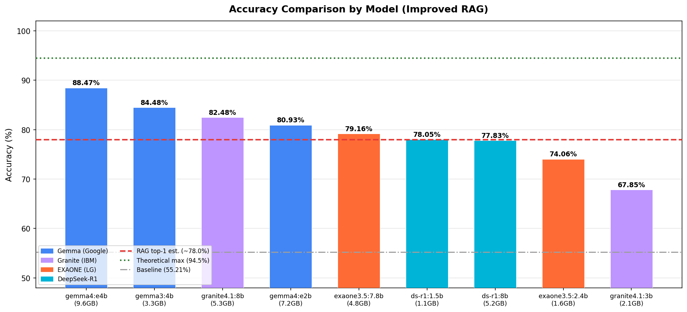
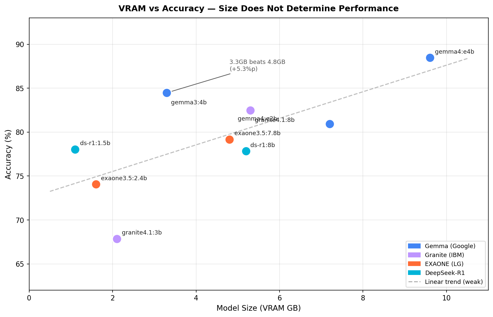
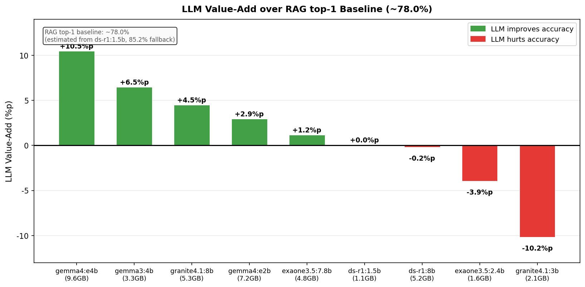
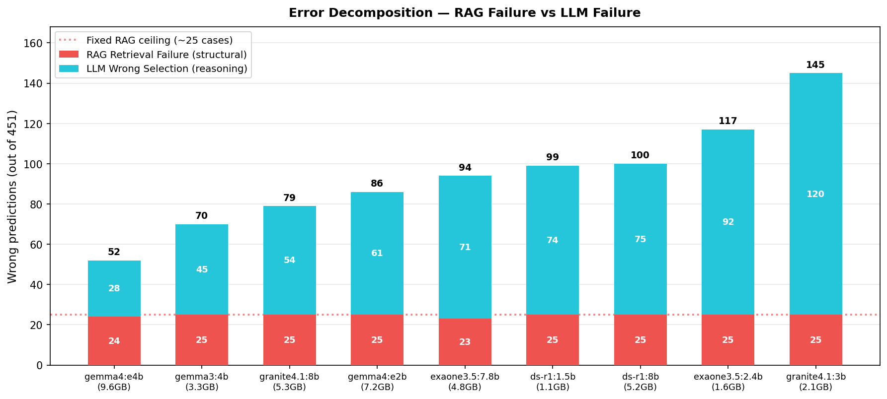
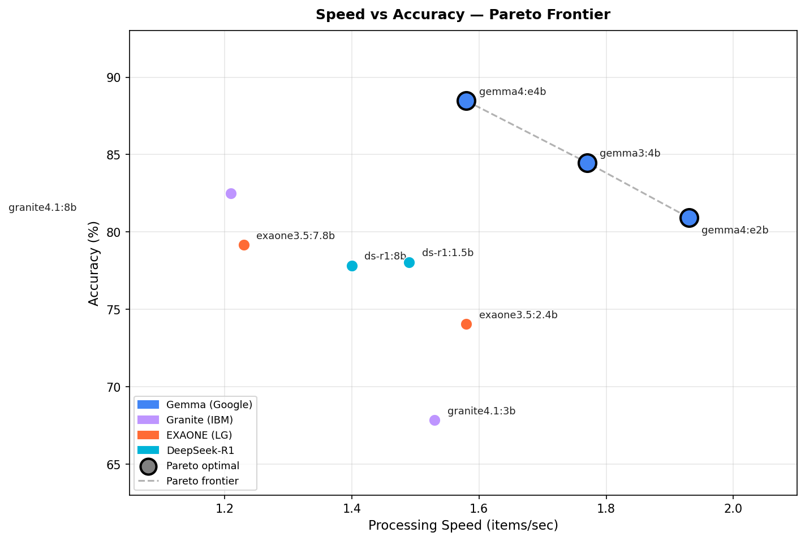

# LLM 실험 결과 분석 — 도출 결론

> 작성일: 2026-05-06  
> 기반 데이터: RAG v2 실험 9개 모델, 451건 평가 (ground_truth_v2), 842건 오답 분석  
> 관련 파일: `performance_report.md`, `error_analysis_v2.xlsx`, `presentation_draft_v3.md`

---

## 전체 실험 결과 요약

| 순위 | 모델 | 크기 | 정확도 | 속도 | Fallback | RAG 오류 | LLM 오류 | 패밀리 |
|:---:|------|-----:|------:|----:|--------:|--------:|--------:|------|
| 🥇 1 | gemma4:e4b | 9.6GB | **88.47%** | 1.58/s | 8.1% | 24 | 28 | Google |
| 🥈 2 | gemma3:4b | 3.3GB | **84.48%** | 1.77/s | 6.5% | 25 | 45 | Google |
| 🥉 3 | granite4.1:8b | 5.3GB | **82.48%** | 1.21/s | 5.0% | 25 | 54 | IBM |
| 4 | gemma4:e2b | 7.2GB | **80.93%** | 1.93/s | 6.4% | 25 | 61 | Google |
| 5 | exaone3.5:7.8b | 4.8GB | **79.16%** | 1.23/s | 9.2% | 23 | 71 | LG |
| 6 | deepseek-r1:1.5b | 1.1GB | **78.05%** | 1.49/s | **85.2%** | 25 | 74 | DeepSeek |
| 7 | deepseek-r1:8b | 5.2GB | **77.83%** | 1.40/s | 2.6% | 25 | 75 | DeepSeek |
| 8 | exaone3.5:2.4b | 1.6GB | **74.06%** | 1.58/s | 13.6% | 25 | 92 | LG |
| 9 | granite4.1:3b | 2.1GB | **67.85%** | 1.53/s | 20.8% | 25 | 120 | IBM |
| — | baseline (best) | — | 55.21% | 1.96/s | — | — | — | — |

---

## 결론 1. 이 태스크의 병목은 "지식"이 아닌 "지시 따르기" 능력



모델 크기와 정확도를 교차 비교하면 파라미터 크기 순서가 성능 순서와 일치하지 않는다:

```
gemma3:4b  (3.3GB) → 84.48%   ← 더 작은데 이긴다
exaone3.5:7.8b (4.8GB) → 79.16%

deepseek-r1:1.5b (1.1GB) → 78.05%  ← 더 작은데 이긴다
exaone3.5:2.4b   (1.6GB) → 74.06%

deepseek-r1:8b  (5.2GB) → 77.83%  ┐
granite4.1:8b   (5.3GB) → 82.48%  ┘  비슷한 크기, 4.7%p 차이
```

**결론**: 이 태스크(15개 후보 중 하나를 JSON으로 선택)는 도메인 지식보다 **"제약 출력 형식 준수 + 후보 비교 추론"** 능력이 성능을 결정한다. Gemma 계열이 전반적으로 우수한 이유도 여기에 있다.

---

## 결론 2. 아키텍처 패밀리가 크기보다 중요하다



| 패밀리 | 모델 크기 | 정확도 | 특이점 |
|-------|------:|------:|------|
| **Gemma (Google)** | e4b 9.6GB | 88.47% | 일관적 강세 |
| | 3:4b 3.3GB | 84.48% | |
| | e2b 7.2GB | 80.93% | |
| **Granite (IBM)** | 8b 5.3GB | 82.48% | 크기 간 편차 15%p — 3b에서 급락 |
| | 3b 2.1GB | 67.85% | |
| **EXAONE (LG)** | 7.8b 4.8GB | 79.16% | 한국어 특화인데 기대 이하 |
| | 2.4b 1.6GB | 74.06% | |
| **DeepSeek-R1** | 8b 5.2GB | 77.83% | 1.5b vs 8b 거의 동점 → 이상 현상 |
| | 1.5b 1.1GB | 78.05% | |

**추가 발견**: EXAONE(한국어 특화)가 이 태스크에서 기대를 못 미치는 이유 — RAG가 이미 한국어 표준명 후보 15개를 제공하기 때문에 LLM의 언어 능력보다 **비교·선택 추론 능력**이 결정 요인이 된다. 임베딩 단계에서 언어 병목이 이미 처리되고, LLM에게는 선택만 남는다.

---

## 결론 3. RAG top-1 기준값 역추정 — LLM 실질 기여도 분리

deepseek-r1:1.5b의 Fallback이 85.2%라는 것은 451건 중 ~384건에서 LLM이 유효한 선택을 하지 못하고 RAG top-1이 그대로 채택됐다는 의미다.

```
deepseek-r1:1.5b 실제 동작:
  ├─ 84.8% → LLM 출력 무효 → RAG top-1 강제 채택 (사실상 RAG-only)
  └─ 15.2% → LLM이 선택 (이 중 일부는 RAG top-1 외 후보 선택)

최종 정확도: 78.05%
→ RAG top-1의 정확도 ≈ 78% (역추정)
```

이를 기준으로 **각 모델의 LLM 실질 기여도**를 계산:

| 모델               |    정확도 |              LLM 기여 (+/-) |
| ---------------- | -----: | ------------------------: |
| gemma4:e4b       | 88.47% |               **+10.5%p** |
| gemma3:4b        | 84.48% |                **+6.5%p** |
| granite4.1:8b    | 82.48% |                **+4.5%p** |
| gemma4:e2b       | 80.93% |                **+2.9%p** |
| exaone3.5:7.8b   | 79.16% |                **+1.2%p** |
| deepseek-r1:1.5b | 78.05% |       ≈ 0%p (RAG-only 수준) |
| deepseek-r1:8b   | 77.83% |                **-0.2%p** |
| exaone3.5:2.4b   | 74.06% |                **-3.9%p** |
| granite4.1:3b    | 67.85% | **-10.2%p** (LLM이 오히려 방해) |



**시사점**: granite4.1:3b는 LLM 없이 RAG top-1만 쓰는 게 더 정확하다. "더 좋은 LLM"과 "더 나쁜 LLM"이 공존하며, 기준보다 못한 모델은 시스템 성능을 저해한다.

---

## 결론 4. RAG 구조가 모든 모델의 공통 하한선을 형성한다



```
9개 모델 모두: RAG 후보 누락 ≈ 25건 (고정)

이론적 최대 정확도 = (451 - 25) / 451 × 100 = 94.5%

현재 최고 모델 (gemma4:e4b) = 88.47%
이론적 최대까지 남은 격차   = 6.0%p
  └─ 이 중 대부분: LLM 오선택 24건 (추론 문제)
```

| 개선 대상 | 개선 방법 | 기대 효과 |
|---------|---------|---------|
| RAG 구조 문제 (~25건) | 일본어 사전, 오탈자 전처리 추가 | 모든 모델 공통 +5~8%p |
| LLM 오선택 (모델별) | 세트/단품·동력원 특화 프롬프트 | 상위 모델 추가 +2~4%p |

**핵심**: RAG 개선은 모든 모델에 동시에 효과가 나타나므로, **ROI 관점에서 LLM 교체보다 RAG 개선이 먼저다.**

---

## 결론 5. 속도 vs 정확도 — Pareto 최적 모델



Pareto 프론티어 위의 모델들 (다른 모델에게 속도·정확도 모두 지지 않는 모델):

| 모델 | 정확도 | 속도 | 크기 | 추천 시나리오 |
|------|------:|----:|----:|------------|
| **gemma4:e4b** | 88.47% | 1.58/s | 9.6GB | 정확도 최우선 |
| **gemma3:4b** | 84.48% | 1.77/s | 3.3GB | **가성비 최고** (크기 대비 최상) |
| **gemma4:e2b** | 80.93% | 1.93/s | 7.2GB | 속도 우선 (가장 빠른 고정확도) |

Pareto 프론티어 바깥(비효율 구간): granite4.1:8b, exaone3.5:7.8b, deepseek-r1:8b 등은 같은 정확도에서 더 빠른 모델이 존재하거나, 같은 속도에서 더 정확한 모델이 존재한다.

---

## 결론 6. 실용 모델 선택 가이드라인

| 환경 제약 | 추천 모델 | 정확도 | 이유 |
|---------|---------|------:|------|
| VRAM 10GB+ | **gemma4:e4b** | 88.47% | 최고 정확도, LLM 기여 최대 |
| VRAM 4GB | **gemma3:4b** | 84.48% | 크기 대비 성능 최고, 빠름 |
| VRAM 8GB, 속도 중시 | **gemma4:e2b** | 80.93% | 최고 처리 속도 (1.93/s) |
| VRAM 6GB | **granite4.1:8b** | 82.48% | 중간 크기 내 최선 |
| VRAM 2GB 이하 | **exaone3.5:2.4b** | 74.06% | ds-r1:1.5b는 78%지만 LLM 기여 없음 |

> **주의**: deepseek-r1:1.5b의 78%는 "LLM이 거의 역할을 하지 않고 RAG top-1을 그대로 쓴" 결과다. 시스템을 운영하는 의미가 없다.

---

## 종합 정리 — 이 실험에서 말할 수 있는 것

| 명제                           | 실험 근거                               | 강도  |
| ---------------------------- | ----------------------------------- | :-: |
| RAG 품질이 LLM 선택보다 더 근본적인 제약   | 모든 모델 공통 ~25건 고정 오류                 | ★★★ |
| 모델 크기보다 아키텍처 패밀리가 성능 결정      | 3.3GB > 4.8GB 사례 다수                 | ★★★ |
| 한국어 특화 임베딩 교체가 가장 큰 단일 개선    | baseline 55% → improved 78%+, +23%p | ★★★ |
| LLM 실질 기여 범위는 ~10%p (max)    | RAG top-1 역추정 78% vs 최고 88.47%      | ★★★ |
| Fallback rate는 LLM 캘리브레이션 지표 | 낮은 fallback이 반드시 좋은 것 아님            | ★★  |
| 소형 모델(3~4GB)로 실무 수준 달성 가능    | gemma3:4b 84.48% (3.3GB)            | ★★★ |
| 한국어 특화 LLM이 이 태스크에서 유리하지 않음  | EXAONE 7.8b = 79%, Gemma 3.3b = 84% | ★★  |

---

*생성: 2026-05-06 | 차트: `_workspace5/charts/` (5개 PNG)*
