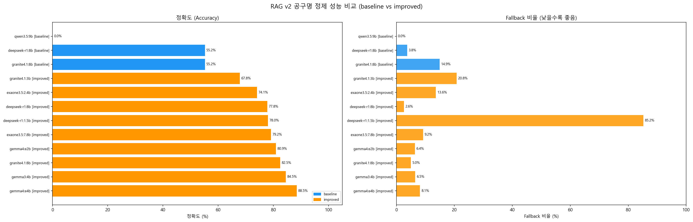

# RAG v2 공구명 정제 — 모델 성능 비교 리포트

> 생성: 2026-05-04 17:55  
> 정제 대상: ToolNameData.csv (3,352개)  
> 평가 기준: standard_tool_names_ground_truth_v2.csv (457개 정답 쌍)  
> RAG 지식베이스: standard_name 160종 목록 (original_name 매핑 제외)  

---

## 성능 비교 표

| 순위 | 모델 (variant) | 임베딩 모델 | K값 | 정확도 | 평가 건수 | 정답 건수 | Fallback율 | 에러율 | 처리속도 | LLM 소요시간 |
|:----:|---------------|-----------|:---:|-------:|--------:|--------:|---------:|------:|-------:|----------:|
| 1 | ✅ `gemma4:e4b` (improved) | `BGE-m3-ko` | 15 | **88.47%** | 451 | 399 | 8.14% | 0.00% | 1.58건/초 | 0:35:20 |
| 2 | ✅ `gemma3:4b` (improved) | `BGE-m3-ko` | 15 | **84.48%** | 451 | 381 | 6.50% | 0.00% | 1.77건/초 | 0:31:32 |
| 3 | ✅ `granite4.1:8b` (improved) | `BGE-m3-ko` | 15 | **82.48%** | 451 | 372 | 5.01% | 0.00% | 1.21건/초 | 0:46:09 |
| 4 | ✅ `gemma4:e2b` (improved) | `BGE-m3-ko` | 15 | **80.93%** | 451 | 365 | 6.38% | 0.00% | 1.93건/초 | 0:28:55 |
| 5 | ✅ `exaone3.5:7.8b` (improved) | `BGE-m3-ko` | 15 | **79.16%** | 451 | 357 | 9.19% | 0.00% | 1.23건/초 | 0:45:31 |
| 6 | ✅ `deepseek-r1:1.5b` (improved) | `BGE-m3-ko` | 15 | **78.05%** | 451 | 352 | 85.20% | 0.39% | 1.49건/초 | 0:37:26 |
| 7 | ✅ `deepseek-r1:8b` (improved) | `BGE-m3-ko` | 15 | **77.83%** | 451 | 351 | 2.60% | 0.03% | 1.40건/초 | 0:39:46 |
| 8 | ✅ `exaone3.5:2.4b` (improved) | `BGE-m3-ko` | 15 | **74.06%** | 451 | 334 | 13.63% | 0.00% | 1.58건/초 | 0:35:24 |
| 9 | ✅ `granite4.1:3b` (improved) | `BGE-m3-ko` | 15 | **67.85%** | 451 | 306 | 20.76% | 0.00% | 1.53건/초 | 0:36:25 |
| 10 | ▪️ `granite4.1:8b` (baseline) | `paraphrase-multilingual-MiniLM-L12-v2` | 5 | **55.21%** | 451 | 249 | 14.91% | 0.00% | 1.26건/초 | 0:44:12 |
| 11 | ▪️ `deepseek-r1:8b` (baseline) | `paraphrase-multilingual-MiniLM-L12-v2` | 5 | **55.21%** | 451 | 249 | 3.76% | 0.06% | 1.96건/초 | 0:28:29 |
| 12 | ▪️ `qwen3.5:9b` (baseline) | `paraphrase-multilingual-MiniLM-L12-v2` | 5 | **0.00%** | 451 | 0 | 0.00% | 100.00% | 1.31건/초 | 0:42:39 |

---

## 성능 차트

> 파란 막대 = baseline | 주황 막대 = improved

---

## 모델별 상세

### 1위. `gemma4:e4b` — ✅ improved

- **임베딩 모델**: `BGE-m3-ko` | **K값**: 15
- **정확도**: 88.47% (399/451건)
- **처리 속도**: 1.58건/초 | **LLM 추론 시간**: 0:35:20 | **임베딩 시간**: 14.4초
- **Fallback**: 8.14% | **에러율**: 0.00%

### 2위. `gemma3:4b` — ✅ improved

- **임베딩 모델**: `BGE-m3-ko` | **K값**: 15
- **정확도**: 84.48% (381/451건)
- **처리 속도**: 1.77건/초 | **LLM 추론 시간**: 0:31:32 | **임베딩 시간**: 8.1초
- **Fallback**: 6.50% | **에러율**: 0.00%

### 3위. `granite4.1:8b` — ✅ improved

- **임베딩 모델**: `BGE-m3-ko` | **K값**: 15
- **정확도**: 82.48% (372/451건)
- **처리 속도**: 1.21건/초 | **LLM 추론 시간**: 0:46:09 | **임베딩 시간**: 9.8초
- **Fallback**: 5.01% | **에러율**: 0.00%

### 4위. `gemma4:e2b` — ✅ improved

- **임베딩 모델**: `BGE-m3-ko` | **K값**: 15
- **정확도**: 80.93% (365/451건)
- **처리 속도**: 1.93건/초 | **LLM 추론 시간**: 0:28:55 | **임베딩 시간**: 12.9초
- **Fallback**: 6.38% | **에러율**: 0.00%

### 5위. `exaone3.5:7.8b` — ✅ improved

- **임베딩 모델**: `BGE-m3-ko` | **K값**: 15
- **정확도**: 79.16% (357/451건)
- **처리 속도**: 1.23건/초 | **LLM 추론 시간**: 0:45:31 | **임베딩 시간**: 10.7초
- **Fallback**: 9.19% | **에러율**: 0.00%

### 6위. `deepseek-r1:1.5b` — ✅ improved

- **임베딩 모델**: `BGE-m3-ko` | **K값**: 15
- **정확도**: 78.05% (352/451건)
- **처리 속도**: 1.49건/초 | **LLM 추론 시간**: 0:37:26 | **임베딩 시간**: 11.0초
- **Fallback**: 85.20% | **에러율**: 0.39%

### 7위. `deepseek-r1:8b` — ✅ improved

- **임베딩 모델**: `BGE-m3-ko` | **K값**: 15
- **정확도**: 77.83% (351/451건)
- **처리 속도**: 1.40건/초 | **LLM 추론 시간**: 0:39:46 | **임베딩 시간**: 29.0초
- **Fallback**: 2.60% | **에러율**: 0.03%

### 8위. `exaone3.5:2.4b` — ✅ improved

- **임베딩 모델**: `BGE-m3-ko` | **K값**: 15
- **정확도**: 74.06% (334/451건)
- **처리 속도**: 1.58건/초 | **LLM 추론 시간**: 0:35:24 | **임베딩 시간**: 10.4초
- **Fallback**: 13.63% | **에러율**: 0.00%

### 9위. `granite4.1:3b` — ✅ improved

- **임베딩 모델**: `BGE-m3-ko` | **K값**: 15
- **정확도**: 67.85% (306/451건)
- **처리 속도**: 1.53건/초 | **LLM 추론 시간**: 0:36:25 | **임베딩 시간**: 8.3초
- **Fallback**: 20.76% | **에러율**: 0.00%

### 10위. `granite4.1:8b` — ▪️ baseline

- **임베딩 모델**: `paraphrase-multilingual-MiniLM-L12-v2` | **K값**: 5
- **정확도**: 55.21% (249/451건)
- **처리 속도**: 1.26건/초 | **LLM 추론 시간**: 0:44:12 | **임베딩 시간**: 5.9초
- **Fallback**: 14.91% | **에러율**: 0.00%

### 11위. `deepseek-r1:8b` — ▪️ baseline

- **임베딩 모델**: `paraphrase-multilingual-MiniLM-L12-v2` | **K값**: 5
- **정확도**: 55.21% (249/451건)
- **처리 속도**: 1.96건/초 | **LLM 추론 시간**: 0:28:29 | **임베딩 시간**: 7.3초
- **Fallback**: 3.76% | **에러율**: 0.06%

### 12위. `qwen3.5:9b` — ▪️ baseline

- **임베딩 모델**: `paraphrase-multilingual-MiniLM-L12-v2` | **K값**: 5
- **정확도**: 0.00% (0/451건)
- **처리 속도**: 1.31건/초 | **LLM 추론 시간**: 0:42:39 | **임베딩 시간**: 7.8초
- **Fallback**: 0.00% | **에러율**: 100.00%

---

## 개선 방법 설명 (improved 버전)

| # | 개선 항목 | 내용 |
|---|-----------|------|
| 1 | **임베딩 모델 교체** | `paraphrase-multilingual-MiniLM-L12-v2` → `dragonkue/BGE-m3-ko` (한국어 KURE 리더보드 1위) |
| 2 | **BM25+FAISS 하이브리드** | 음절 bigram BM25(40%) + FAISS 시맨틱(60%) 혼합 검색 |
| 3 | **K값 확대** | 후보 5개 → 15개 |
| 4 | **카테고리 주입** | ToolNameData의 Categories / SubCategories 정보를 프롬프트에 포함 |

---

## 용어 설명

- **정확도**: ground_truth_v2의 original_name 매핑 standard_name과 예측값 일치율
- **Fallback**: LLM이 후보 외 답변 → RAG top-1으로 강제 대체된 비율
- **RAG 지식베이스**: standard_name 160종 목록만 사용 (original_name→standard_name 매핑 미포함)
