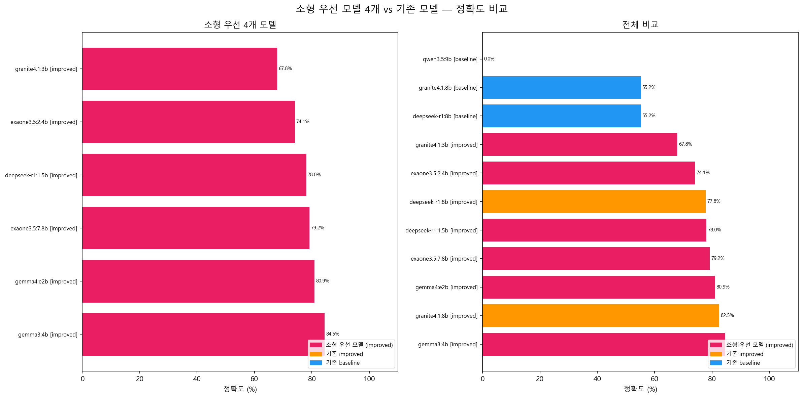

# 소형 우선 모델 6개 vs 기존 완료 모델 — 중간 성능 비교 리포트

> 생성: 2026-05-04 14:57  
> 소형 우선 모델: deepseek-r1:1.5b · exaone3.5:2.4b · granite4.1:3b · gemma3:4b · exaone3.5:7.8b · gemma4:e2b (improved only)  
> 기존 완료 모델: deepseek-r1:8b · granite4.1:8b (baseline + improved)  
> 정제 대상: 3,352개 | 평가 기준: ground_truth_v2.csv (457개)  

---

## 소형 우선 모델 성능 (🔹) — 6개

|                순위                | 모델 (variant) | 정확도 | 평가 건수 |  정답 건수 | Fallback율 |     에러율 |    처리속도 | LLM 소요시간 |
| :------------------------------: | ------------ | --: | ----: | -----: | --------: | ------: | ------: | -------: |
|    🔹 `gemma3:4b` (improved)     | **84.48%**   | 451 |   381 |  6.50% |     0.00% | 1.77건/초 | 0:31:32 |          |
|    🔹 `gemma4:e2b` (improved)    | **80.93%**   | 451 |   365 |  6.38% |     0.00% | 1.93건/초 | 0:28:55 |          |
|  🔹 `exaone3.5:7.8b` (improved)  | **79.16%**   | 451 |   357 |  9.19% |     0.00% | 1.23건/초 | 0:45:31 |          |
| 🔹 `deepseek-r1:1.5b` (improved) | **78.05%**   | 451 |   352 | 85.20% |     0.39% | 1.49건/초 | 0:37:26 |          |
|  🔹 `exaone3.5:2.4b` (improved)  | **74.06%**   | 451 |   334 | 13.63% |     0.00% | 1.58건/초 | 0:35:24 |          |
|  🔹 `granite4.1:3b` (improved)   | **67.85%**   | 451 |   306 | 20.76% |     0.00% | 1.53건/초 | 0:36:25 |          |

---

## 요약

| 구분 | 최고 정확도 |
|------|----------:|
| 🔹 소형 우선 4개 (improved) | **84.48%** |
| ✅ 기존 improved best | **82.48%** |

> 소형 모델 최고 정확도가 기존 improved best 대비 **+2.0%p** 높거나 동등합니다.

---

## 전체 순위 (소형 🔹 포함)

| 순위  | 모델 (variant)                     |        정확도 | 평가 건수 | 정답 건수 | Fallback율 |     에러율 |    처리속도 | LLM 소요시간 |
| :-: | -------------------------------- | ---------: | ----: | ----: | --------: | ------: | ------: | -------: |
|  1  | 🔹 `gemma3:4b` (improved)        | **84.48%** |   451 |   381 |     6.50% |   0.00% | 1.77건/초 |  0:31:32 |
|  2  | ✅ `granite4.1:8b` (improved)     | **82.48%** |   451 |   372 |     5.01% |   0.00% | 1.21건/초 |  0:46:09 |
|  3  | 🔹 `gemma4:e2b` (improved)       | **80.93%** |   451 |   365 |     6.38% |   0.00% | 1.93건/초 |  0:28:55 |
|  4  | 🔹 `exaone3.5:7.8b` (improved)   | **79.16%** |   451 |   357 |     9.19% |   0.00% | 1.23건/초 |  0:45:31 |
|  5  | 🔹 `deepseek-r1:1.5b` (improved) | **78.05%** |   451 |   352 |    85.20% |   0.39% | 1.49건/초 |  0:37:26 |
|  6  | ✅ `deepseek-r1:8b` (improved)    | **77.83%** |   451 |   351 |     2.60% |   0.03% | 1.40건/초 |  0:39:46 |
|  7  | 🔹 `exaone3.5:2.4b` (improved)   | **74.06%** |   451 |   334 |    13.63% |   0.00% | 1.58건/초 |  0:35:24 |
|  8  | 🔹 `granite4.1:3b` (improved)    | **67.85%** |   451 |   306 |    20.76% |   0.00% | 1.53건/초 |  0:36:25 |
|  9  | ▪️ `deepseek-r1:8b` (baseline)   | **55.21%** |   451 |   249 |     3.76% |   0.06% | 1.96건/초 |  0:28:29 |
| 10  | ▪️ `granite4.1:8b` (baseline)    | **55.21%** |   451 |   249 |    14.91% |   0.00% | 1.26건/초 |  0:44:12 |
| 11  | ▪️ `qwen3.5:9b` (baseline)       |  **0.00%** |   451 |     0 |     0.00% | 100.00% | 1.31건/초 |  0:42:39 |

---

## 성능 차트

> 🔹 핑크 = 소형 우선 모델 | 주황 = 기존 improved | 파랑 = 기존 baseline
